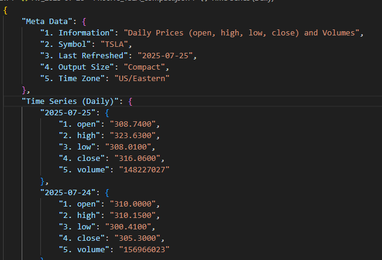
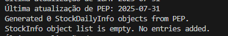
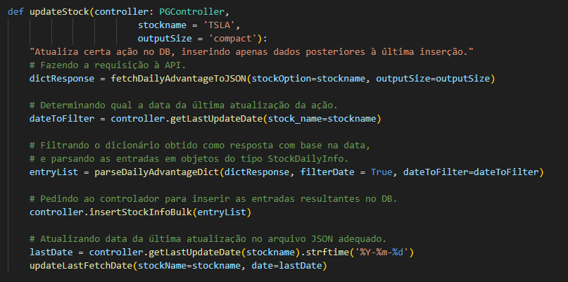
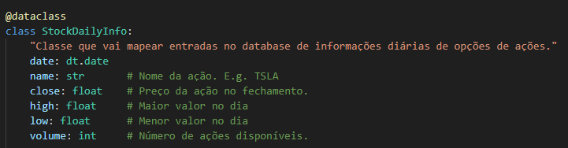
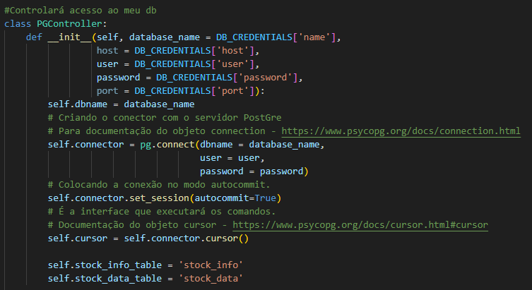
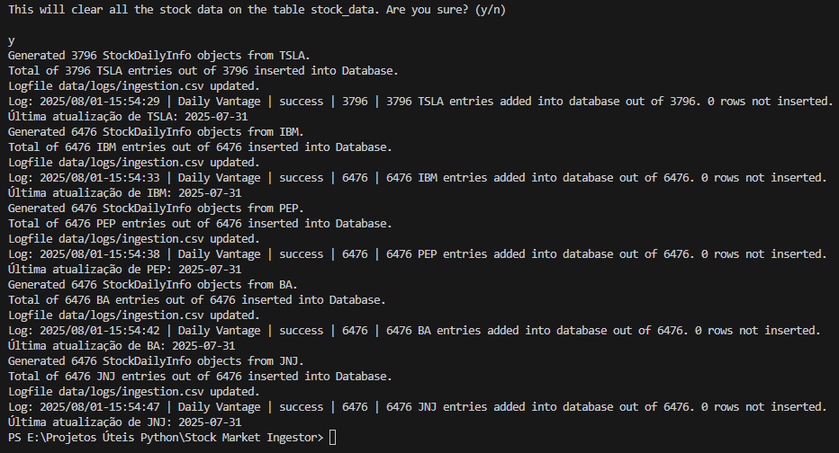
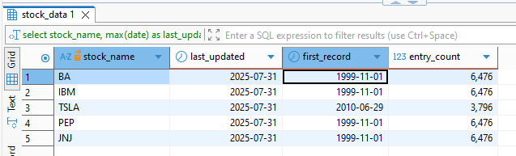
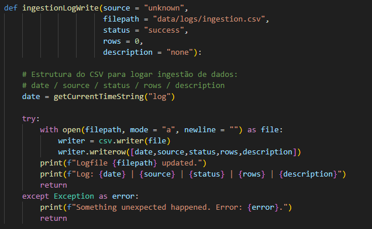
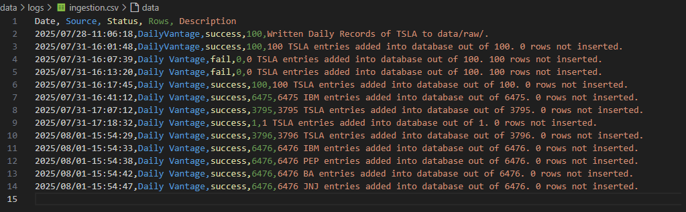
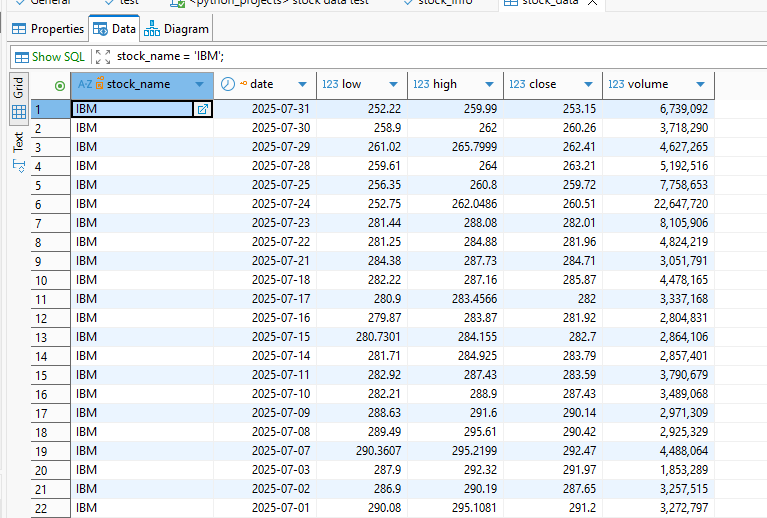

# Atualizador automático de informações de ações

## O que é isso? 🤔

Esse é um pequeno programa de Python que criei para fazer requisições a uma API contendo informações de ações e armazená-las em um database para um projeto futuro. Separei cinco ações específicas - Tesla, IBM, Pepsi Co, Boeing e Johnson & Johnson - para manter dados atualizados no meu DB (instância de PostgreSQL). Ao fim, criei uma tarefa agendada no Windows Task Scheduler para rodar automaticamente o script de atualização do DB a cada 3 dias.

Em suma, essa é basicamente uma Pipeline de dados automatizada, com processos de validação e transformação realizados no meio do caminho. Também há uma funcionalidade de manutenção de logs referente à entrada de dados e o status das requisições.

## Como funciona? 😯

A maior parte da lógica do programa está no módulo fetchData.py. Usando a biblioteca *requests.py*, faço uma requisição à API do [Alpha Vantage](https://www.alphavantage.co/documentation/) dos dados diários de determinadas ações. O resultado é um dicionário contendo os dados relativos aos últimos 100 dias para aquela ação, incluíndo menor valor, maior valor e, mais importante para nossos propósitos, valor no fechamento.

(exemplo de resposta da requisição)

Esses dados são filtrados com relação à última atualização de determinada ação no meu banco de dados. Se eles são mais atuais que a última entrada no DB, os dados são transformados em uma classe própria que criei para fazer interface com o Banco de Dados; se não, são descartados.

Por fim, os dados resultantes são inseridos um a um no meu DB. O script diário meramente toma uma lista de ações, definida em config.py, e chama a função de atualização em todas elas.

## Mais detalhes, por favor 📚

Meu programa tem apenas duas classes definidas, ambas em datamodels.py: a **StockDailyInfo**, uma dataclass criada para facilitar a validação dos dados e a inserção no DB, e a **PGConnector** (PG de PostGres), criada para administrar a conexão com meu banco de dados e parametrizar os queries.

(classe StockDailyInfo)

(classe PGController)

Importante frisar que usei um arquivo oculto chamado .env para definir certas variáveis de ambiente relacionadas à autenticação e outros dados sensíveis. Elas são recuperadas pelo módulo dotenv e carregadas pelo arquivo config.py. De importante, estão só minha API Key do Alpha Vantage e o user, password e nome do meu DB. Caso queira rodar esse script em sua máquina, é importante ajustar tais variáveis para garantir que o programa rode adequadamente.

O programa também pressupõe que há um Schema chamado "public", e usa as tables "stock_data" e "stock_info" para realizar as operações. Por via das dúvidas, inseri uma função na classe PGController que instancia justamente essas tabelas no DB definindo, bem como uma função chamada initializeDatabase no módulo main.py que ambos cria tais tabelas e popula com dados iniciais para fazer o DB rodar.

(rodando a função initializeDatabase para popular meu DB com dados iniciais)

(resultado visto pelo DBeaver)

Também tenho uma função de log bem simples para manter os dados de inserção e poder verificar quaisquer falhas do script. Tais funções estão no arquivo logging_utilities.py, e o log fica salvo em data/logs.

(função de log)

(exemplo de log)

## Próximos passos ✏

O script tem alguns problemas que pretendo remediar depois, tal como a lógica de gerenciamento de exceções e a conexão com hosts externos. No caso, o script só foi testado com meu Database Local, e as classes não estão bem ajustadas para acessar DBs remotos. Mas para o meu propósito inicial, que era manter um DB com dados de ações, considero o projeto um sucesso.

O mais desafiador foi pensar como lidar com os possíveis erros em cada etapa do processo, bem como incluir uma estrutura de logging que fosse simples. Como nunca havia trabalhado com logs antes, pensar o que loggar e como loggar foi um desafio. 

Se o script só fizesse uma requisição à API e inserisse os dados em um DB qualquer, ele seria muito mais simples - mas também muito menos robusto. Inserir uma lógica de validação, de registro e de segurança foi o que tornou esse projeto bastante trabalhoso, de certa maneira - pelo menos comparado a outros projetos que desenvolvi. 

Agora pretendo usar tais dados para um simulador de plataforma de investimentos. A ideia é recuperar dados históricos como se fossem dados do dia, e permitir aos usuários "investirem" em ações, acompanhando o desenvolvimento dos investimentos diariamente. Também pretendo criar quatro inteligências artificiais para competirem entre si e ver que tipo de estratégia tem mais sucesso para as ações armazenadas. Mas isso é coisa para outros voos.

(para não dizer que não falei das flores)

Abraços, e qualquer dúvida sobre o código estou à disposição.

#### Quickstart

Se você quer testar o script, siga os seguintes passos:
1. Gere uma API Key gratuita em Alpha Vantage. Insira a key na variável **ALPHA_API_KEY** em config.py
2. Instancie um banco de dados PostgreSQL, com usuário com poderes suficientes para criar e alterar tabelas. Verifique se o Database instanciado tem um Schema chamado "public". Insira as credenciais do seu Database e informações de conexão em **DB_CREDENTIALS**, também em config.py. Você pode testar a conexão pela função testConnection().
3. Para alterar a lista de ações, mude a variável **ACTIVE_STOCKS** em config.py.
4. Agora usando main.py, rode a função **initializeDatabases**. Se tudo estiver correto, o programa imprimirá no console as entradas e o log será atualizado.
5. Mude o corpo da função main() para rodar a função updateAllStocks(). Crie uma tarefa agendada no Windows Schedule Manager ou no seu scheduler de preferência rodando main periodicamente. O script deve puxar os dados mais atuais a cada execução e inseri-los em seu database.

Toda interface com o programa pode ser feita pelo arquivo main.py. Caso encontre problemas, por favor me avise.